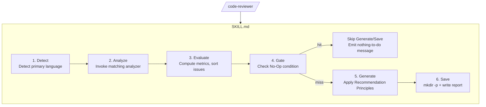
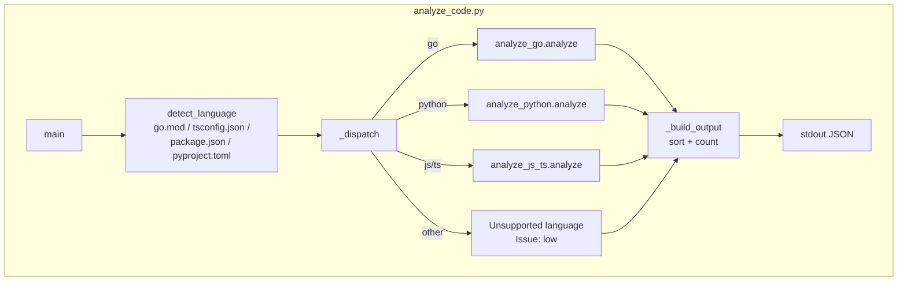
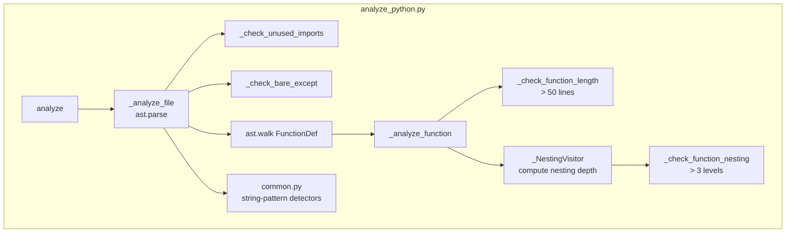
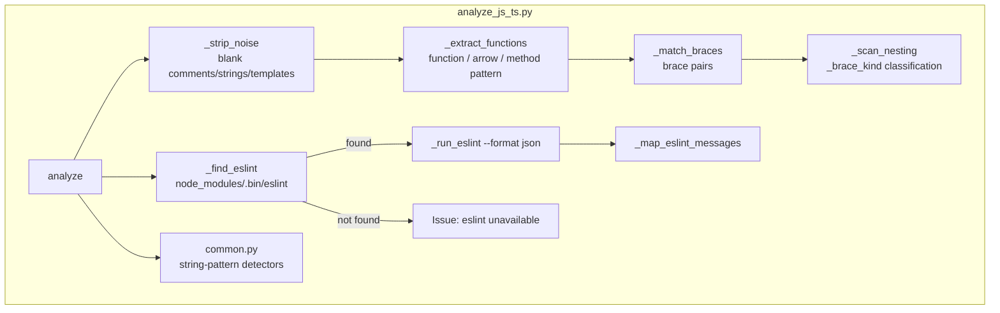
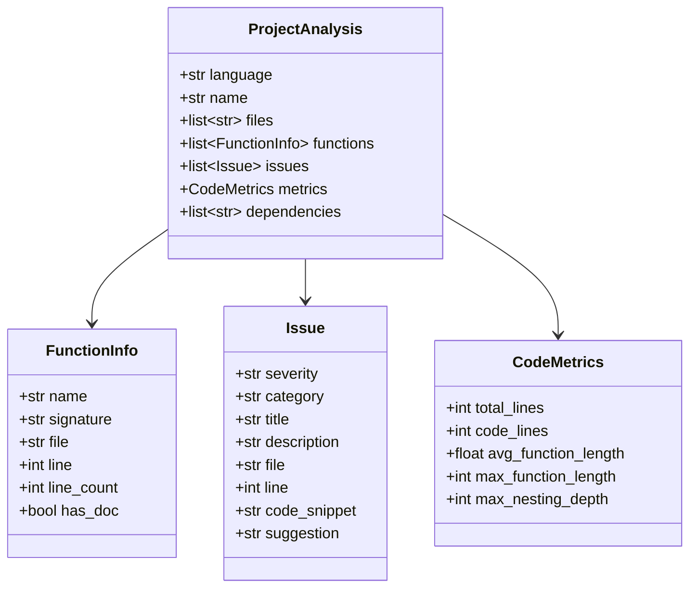
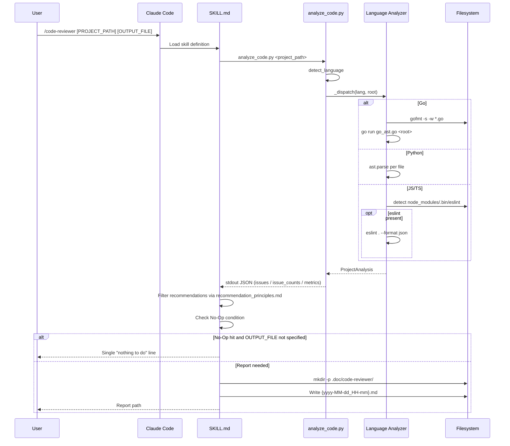
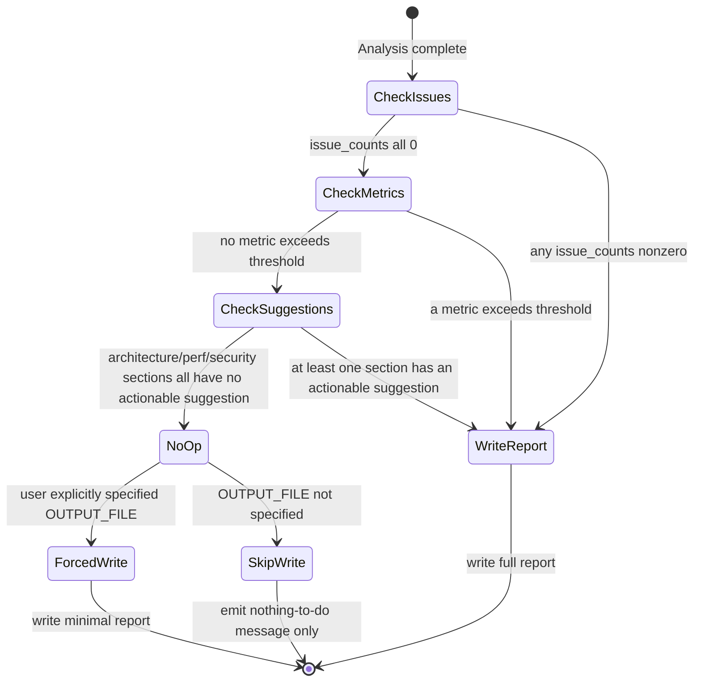

# code-reviewer - Architecture

> Back to [README](../README.md)

## Overview

```mermaid
graph TB
    User[User] -->|/code-reviewer PROJECT_PATH OUTPUT_FILE| SKILL[SKILL.md<br/>Orchestration]
    SKILL --> Entry[analyze_code.py<br/>Language Detect + Dispatch]
    Entry -->|go| Go[analyze_go.py]
    Entry -->|python| Py[analyze_python.py]
    Entry -->|js/ts| JS[analyze_js_ts.py]
    Go --> AST[go_ast.go<br/>run via go run]
    Go --> Common[common.py<br/>Shared Detectors]
    Py --> Common
    JS --> Common
    JS --> ESLint[Project-local eslint<br/>optional]
    AST --> Result[ProjectAnalysis JSON]
    Common --> Result
    ESLint --> Result
    Result --> Gate[No-Op Gate]
    Gate -->|hit| Notice[Emit "nothing to do" message]
    Gate -->|miss| Report[.doc/code-reviewer/<br/>Optimization Report]
```

## Module: SKILL.md (Orchestration)

Defines the six-stage Detect → Analyze → Evaluate → Gate → Generate → Save workflow and validation checklist. Contains no executable code — it constrains Claude's behavior through prompt instructions.



## Module: analyze_code.py (Entry Point + Dispatch)

After detecting the project's primary language, dispatches to the corresponding analyzer; assembles `issue_counts`, sorts `issues`, and emits a single JSON blob.



## Module: analyze_go.py + go_ast.go (Go Analyzer)

`analyze_go.py` handles `gofmt` preprocessing, `go.mod` parsing, and string-pattern scans (credentials / SQL / command injection / comment blocks), then invokes `go_ast.go` (a standalone Go program run via `go run`) for the results that need real AST — function signatures, unused imports, `interface{}` detection, discarded return values — and merges them into a single `ProjectAnalysis`.

```mermaid
graph TB
    subgraph GoPy["analyze_go.py"]
        Analyze[analyze] --> GoMod[_apply_go_mod<br/>parse module/require]
        Analyze --> ScanSrc[_scan_sources<br/>per-file gofmt + string scan]
        Analyze --> RunAST[_run_ast_helper]
        RunAST --> Merge[_merge_ast_output]
        Merge --> Metrics[_finalize_function_metrics]
    end
    subgraph GoAST["go_ast.go (go run)"]
        WalkFS[filepath.Walk *.go] --> AnalyzeFile[analyzeFile]
        AnalyzeFile --> UnusedImport[checkUnusedImport]
        AnalyzeFile --> EmptyInterface[interface{} detection]
        AnalyzeFile --> FuncInfo[analyzeFunction<br/>signature / lines / nesting]
        AnalyzeFile --> Discarded[checkDiscardedReturn<br/>_ = f() pattern]
        FuncInfo --> JSONOut[JSON stdout]
        UnusedImport --> JSONOut
        EmptyInterface --> JSONOut
        Discarded --> JSONOut
    end
    RunAST -->|go run go_ast.go root| WalkFS
    JSONOut -->|subprocess stdout| RunAST
    ScanSrc --> Common[common.py<br/>detect_hardcoded_credentials<br/>detect_sql_injection<br/>detect_command_injection<br/>detect_commented_code]
```

## Module: analyze_python.py (Python Analyzer)

Parses the syntax tree with the built-in `ast` module: `_NestingVisitor` walks `If/For/While/Try/With` nodes to compute nesting depth, alongside unused-import checks (matching `ast.Name`/`ast.Attribute` references) and bare `except:` detection.



## Module: analyze_js_ts.py (JavaScript/TypeScript Analyzer)

First blanks out comments/strings/template literals with `_strip_noise` (preserving line numbers), then uses brace-matching to locate function boundaries and nesting depth; `_find_eslint` detects a project-local eslint and, if present, runs it and maps messages into `Issue` objects.



## Module: common.py (Shared Types + Detectors)

Provides the `Issue`/`FunctionInfo`/`CodeMetrics`/`ProjectAnalysis` dataclasses plus three string-pattern detection functions shared across the Go/Python/JS-TS analyzers.



**Shared detectors**: `detect_hardcoded_credentials` (keyword + Shannon entropy), `detect_sql_injection`, `detect_command_injection`, `detect_commented_code`.

## Data Flow

Complete flow of a single `/code-reviewer` invocation:



## No-Op Gate State Machine



***

©️ 2026
