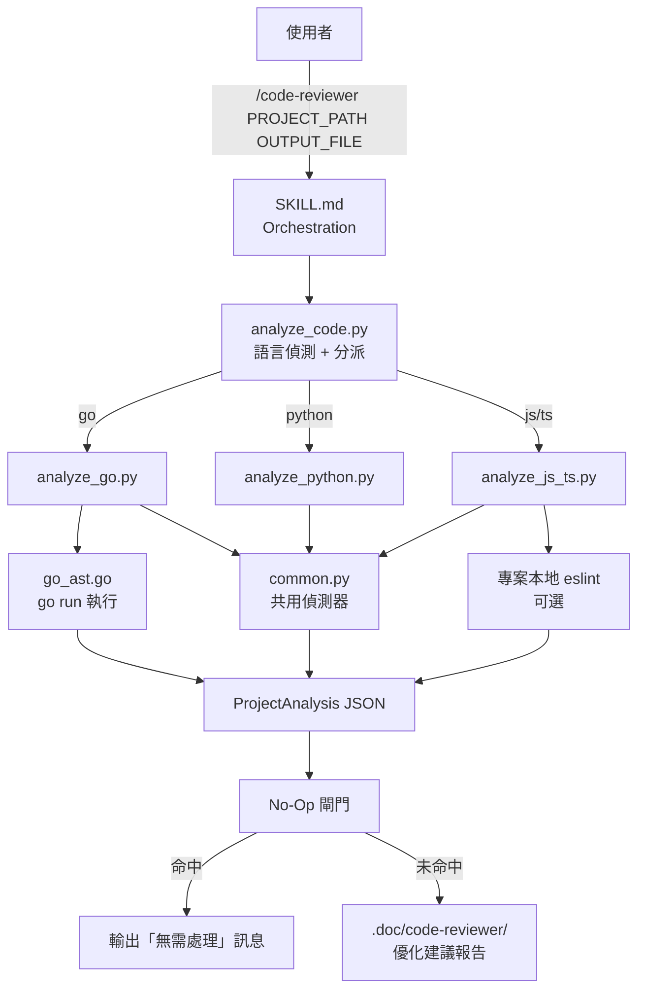
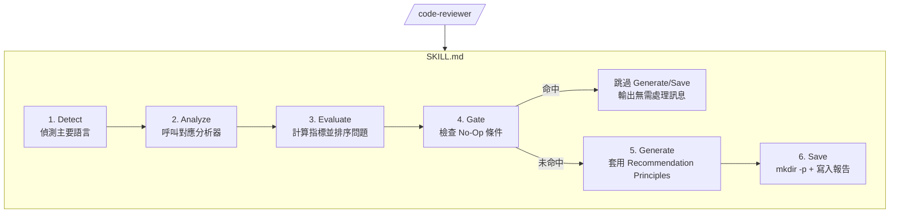
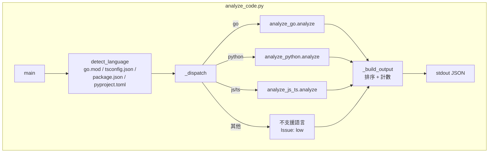
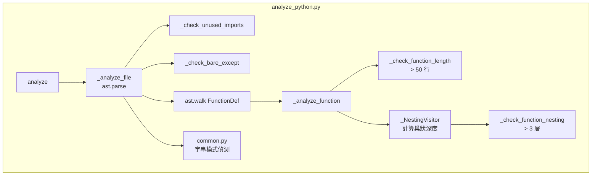
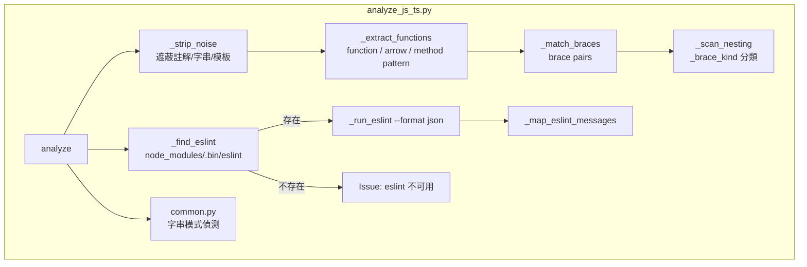
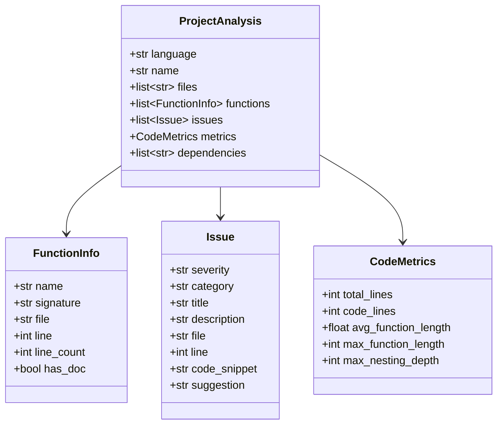
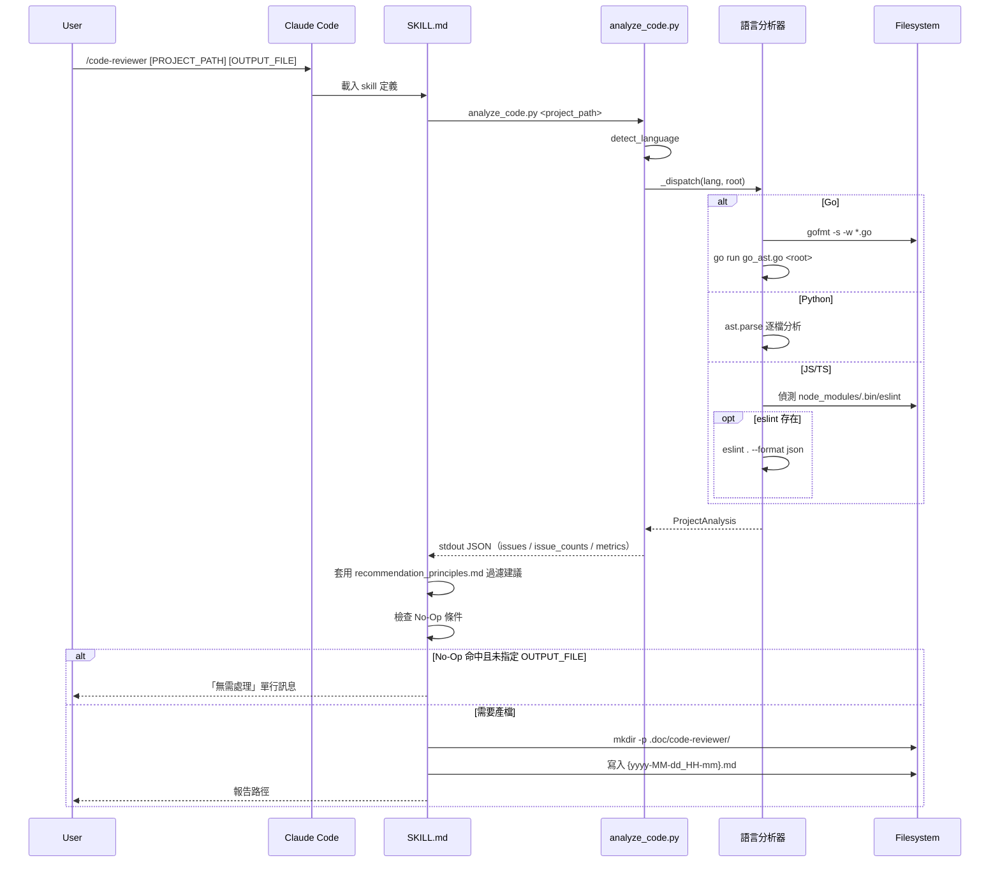
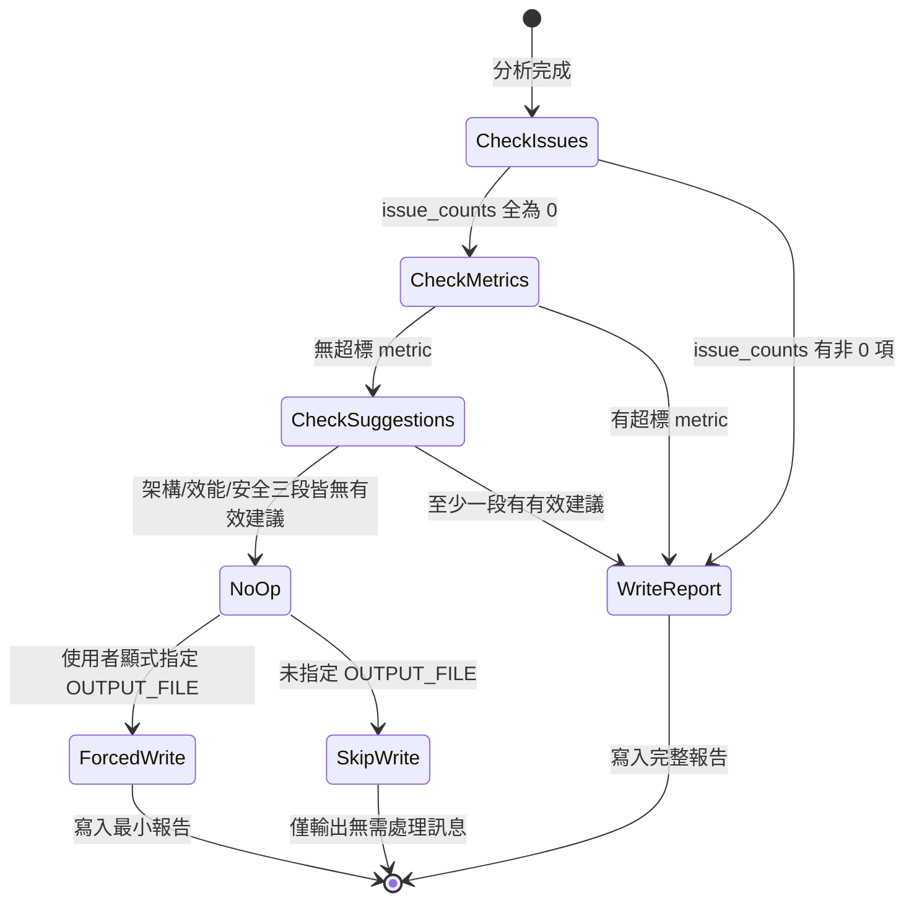

# code-reviewer - 架構

> 返回 [README](./README.zh.md)

## Overview



## Module: SKILL.md（Orchestration）

定義 Detect → Analyze → Evaluate → Gate → Generate → Save 六階段流程與驗證清單，不含可執行程式碼，透過 prompt 指令約束 Claude 的行為。



## Module: analyze_code.py（進入點 + 分派）

偵測專案主要語言後，分派給對應分析器；統一組裝 `issue_counts`、排序 `issues`，輸出單一 JSON。



## Module: analyze_go.py + go_ast.go（Go 分析器）

`analyze_go.py` 負責 `gofmt` 前處理、`go.mod` 解析與字串模式掃描（憑證／SQL／指令注入／連續註解），並呼叫 `go_ast.go`（獨立 Go 程式，透過 `go run` 執行）取得函式簽章、未使用 import、`interface{}` 偵測、丟棄回傳值等需要真正 AST 的結果，再合併為單一 `ProjectAnalysis`。

```mermaid
graph TB
    subgraph GoPy["analyze_go.py"]
        Analyze[analyze] --> GoMod[_apply_go_mod<br/>解析 module/require]
        Analyze --> ScanSrc[_scan_sources<br/>逐檔 gofmt + 字串掃描]
        Analyze --> RunAST[_run_ast_helper]
        RunAST --> Merge[_merge_ast_output]
        Merge --> Metrics[_finalize_function_metrics]
    end
    subgraph GoAST["go_ast.go（go run）"]
        WalkFS[filepath.Walk *.go] --> AnalyzeFile[analyzeFile]
        AnalyzeFile --> UnusedImport[checkUnusedImport]
        AnalyzeFile --> EmptyInterface[interface{} 偵測]
        AnalyzeFile --> FuncInfo[analyzeFunction<br/>簽章 / 行數 / 巢狀深度]
        AnalyzeFile --> Discarded[checkDiscardedReturn<br/>_ = f() 模式]
        FuncInfo --> JSONOut[JSON stdout]
        UnusedImport --> JSONOut
        EmptyInterface --> JSONOut
        Discarded --> JSONOut
    end
    RunAST -->|go run go_ast.go root| WalkFS
    JSONOut -->|subprocess stdout| RunAST
    ScanSrc --> Common[common.py<br/>detect_hardcoded_credentials<br/>detect_sql_injection<br/>detect_command_injection<br/>detect_commented_code]
```

## Module: analyze_python.py（Python 分析器）

使用內建 `ast` 模組解析語法樹：`_NestingVisitor` 走訪 `If/For/While/Try/With` 節點計算巢狀深度，額外檢查未使用 import（比對 `ast.Name`／`ast.Attribute` 引用）與裸 `except:`。



## Module: analyze_js_ts.py（JavaScript/TypeScript 分析器）

先以 `_strip_noise` 遮蔽註解／字串／模板字面值（保留行數），再以 brace-matching 找出函式邊界與巢狀深度；`_find_eslint` 偵測專案本地 eslint，存在時執行並映射訊息為 `Issue`。



## Module: common.py（共用型別與偵測器）

提供 `Issue`／`FunctionInfo`／`CodeMetrics`／`ProjectAnalysis` dataclass，以及三個語言共用的字串模式偵測函式，供 Go／Python／JS-TS 分析器直接呼叫。



**共用偵測函式**：`detect_hardcoded_credentials`（關鍵字 + Shannon entropy）、`detect_sql_injection`、`detect_command_injection`、`detect_commented_code`。

## Data Flow

完整一次 `/code-reviewer` 呼叫的資料流：



## No-Op 閘門狀態機



***

©️ 2026
